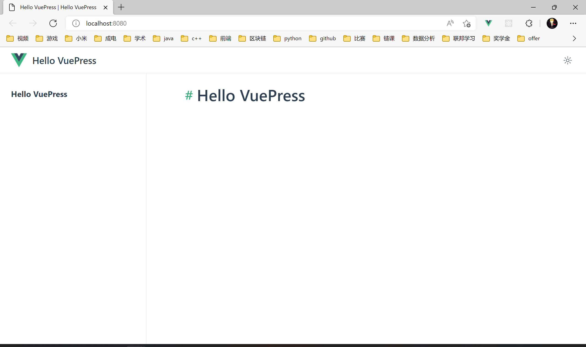
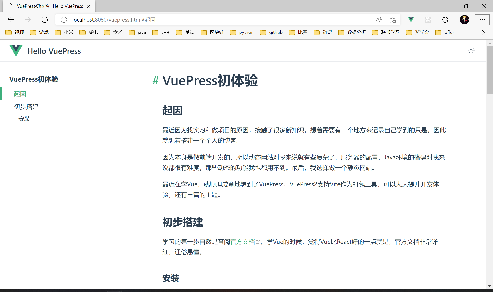

# VuePress初体验

## 起因

最近因为找实习和做项目的原因，接触了很多新知识，想着需要有一个地方来记录自己学到的只是，因此就想着搭建一个个人的博客。

因为本身是做前端开发的，所以动态网站对我来说就有些复杂了，服务器的配置、Java环境的搭建对我来说都很有难度，那些动态的功能我也都用不到。最后，我选择做一个静态网站。

最近在学Vue，就顺理成章地想到了VuePress。VuePress2支持Vite作为打包工具，可以大大提升开发体验，还有丰富的主题。

## 初步搭建

学习的第一步自然是查阅[官方文档](https://v2.vuepress.vuejs.org/zh/)。学Vue的时候，觉得Vue比React好的一点就是，官方文档非常详细，通俗易懂。

1. 创建一个新目录

    ```sh
    mkdir my-blog
    cd my-blog
    ```

2. 初始化项目

    ```sh
    git init
    yarn init
    ```

    这里使用了git和yarn。用git应该是方便以后的部署，而yarn其实可以用npm或者pnpm之类的去替换，但是官方用的yarn，就不做改动了。

3. 安装本地依赖

    ```sh
    yarn add -D vuepress@next
    ```

    这里因为用的是VuePress2的版本，所以安装的是`vuepress@next`。

4. 在`package.json`中添加启动脚本

    ```json
    "scripts": {
        "docs:dev": "vuepress dev docs",
        "docs:build": "vuepress build docs"
    }
    ```

    这里其实已经可以启动了

    ```sh
    yarn docs:dev
    ```

    但是我还是继续做一些配置

5. 编写`.gitignore`文件

    ```sh
    echo 'node_modules' >> .gitignore
    echo '.temp' >> .gitignore
    echo '.cache' >> .gitignore
    ```

6. 在`docs/.vuepress`目录下新建config.ts文件，写一些基本配置

    ```ts
    import { defineUserConfig } from "vuepress";
    import type { DefaultThemeOptions } from "vuepress";

    export default defineUserConfig<DefaultThemeOptions>({
    // 站点配置
    lang: "zh-CN",
    title: "Hello VuePress",
    description: "Just playing around",

    // 主题和它的配置
    theme: "@vuepress/theme-default",
    themeConfig: {
        logo: "https://vuejs.org/images/logo.png",
    },
    });
    ```

    这些配置等到定制主题的时候再去修改。

7. 创建第一篇文档

    ```sh
    echo '# Hello VuePress' > docs/README.md
    ```

8. 启动服务器

    ```sh
    yarn docs:dev
    ```

    可以在本地的[http://localhost:8080/](http://localhost:8080/)访问到这篇`README.md`文档，其中的内容被自动解析为HTMl。

    

9. 约定式路由

    VuePress采用了约定式路由的方式，`docs`目录下即为路由路径，其中`README.md`为根目录。

    为了试验约定式路由，我写了这篇文档（在这里就不套娃了），放在`docs/vuepress.md`中。

    将浏览器的URL改为`http://localhost:8080/vuepress`就看到了这篇文章。

    

## 部署

将网页部署到GitHub Pages上，这样就能以免费的方式，拥有一个公网的域名，可以访问自己的网站。

1. 在`config.ts`中设置

    ```json
    base: "/my-blog/"
    ```

2. 创建`.github/workflows/docs.yml`文件，配置GitHub Actions工作流

    ```yml
    name: docs
    
    on:
      # 每当 push 到 master 分支时触发部署
      push:
        branches: [master]
      # 手动触发部署
      workflow_dispatch:
    
    jobs:
      docs:
        runs-on: ubuntu-latest
    
        steps:
          - uses: actions/checkout@v2
            with:
              # “最近更新时间” 等 git 日志相关信息，需要拉取全部提交记录
              fetch-depth: 0
    
          - name: Setup Node.js
            uses: actions/setup-node@v1
            with:
              # 选择要使用的 node 版本
              node-version: "14"
    
          # 缓存 node_modules
          - name: Cache dependencies
            uses: actions/cache@v2
            id: yarn-cache
            with:
              path: |
                **/node_modules
              key: ${{ runner.os }}-yarn-${{ hashFiles('**/yarn.lock') }}
              restore-keys: |
                ${{ runner.os }}-yarn-
    
          # 如果缓存没有命中，安装依赖
          - name: Install dependencies
            if: steps.yarn-cache.outputs.cache-hit != 'true'
            run: yarn --frozen-lockfile
    
          # 运行构建脚本
          - name: Build VuePress site
            run: yarn docs:build
    
          # 查看 workflow 的文档来获取更多信息
          # @see https://github.com/crazy-max/ghaction-github-pages
          - name: Deploy to GitHub Pages
            uses: crazy-max/ghaction-github-pages@v2
            with:
              # 部署到 gh-pages 分支
              target_branch: gh-pages
              # 部署目录为 VuePress 的默认输出目录
              build_dir: dist
            env:
              # @see https://docs.github.com/cn/actions/reference/authentication-in-a-workflow#about-the-github_token-secret
              GITHUB_TOKEN: ${{ secrets.GITHUB_TOKEN }}
    ```

3. 将项目push到GitHub仓库，自动执行Action，即可完成部署。在`[https://<USERNAME>.github.io/<REPO>/]`中可以看到自己的页面。

## 配置主题

默认的主题其实更适合于写文档，而我需要找一个适用于博客的主题，并且做一些配置，能有基础的页面样式、导航和路由之类的功能。这里选择了[vuepress-theme-hope](https://vuepress-theme-hope.github.io/v2/zh/)的v2版本，这个主题提供了完整的博客功能。

### 初始化

删除原来的docs文件夹，用主题的脚手架重新生成。当然，要记得保存之前写的文档。

```sh
npm init vuepress-theme-hope@next docs
```

输入命令后，按照选项一步一步选即可。选完就能看到[demo](http://localhost:8080/)了。


### 配置

#### 全局配置

修改`config.ts`对项目进行基本的配置，[这里](https://github.com/xiafrog/my-blog/blob/master/docs/.vuepress/config.ts)可以看到本项目的配置。

  主要对默认的路由路径以及语言进行了设置。

  ```ts {5,19-25}
  import { defineHopeConfig } from "vuepress-theme-hope";
  import themeConfig from "./themeConfig";

  export default defineHopeConfig({
    base: "/my-blog/",

    dest: "./dist",

    head: [
      [
        "link",
        {
          rel: "stylesheet",
          href: "//at.alicdn.com/t/font_2410206_mfj6e1vbwo.css",
        },
      ],
    ],

    locales: {
      "/": {
        lang: "zh-CN",
        title: "鱼塘",
        description: "俞浩然的个人博客",
      },
    },

    themeConfig,
  });
  ```

- 在写这一部分的过程中，本来以为代码行高亮的功能是内置插件，在VuePress中也是默认开启的。但是不生效，只能用`markdown.code.highlightLines: true`手动开启。最后发现，原来是逗号间不能有空格.

```md
<!-- 错误 -->
```ts {5, 19-25}

<!-- 正确 -->
```ts {5,19-25}
```

#### 主题配置

修改`themeConfig.ts`对项目进行基本的配置，[这里](https://github.com/xiafrog/my-blog/blob/master/docs/.vuepress/themeConfig.ts)可以看到本项目的配置。

主要参考了官方文档中的[主题配置](https://vuepress-theme-hope.github.io/v2/zh/config/theme/#%E9%85%8D%E7%BD%AE%E4%BB%8B%E7%BB%8D)

其中，单独配置了导航栏和侧边栏。

```ts
//navbar.ts
import { defineNavbarConfig } from "vuepress-theme-hope";

export default defineNavbarConfig([
  "/",
  {
    text: "前端",
    icon: "template",
    prefix: "/frontend/",
    children: [
      {
        text: "前端工具",
        prefix: "tools/",
        children: ["vuepress.md"],
      },
    ],
  },
]);

//sidebar.ts
import { defineSidebarConfig } from "vuepress-theme-hope";

export default defineSidebarConfig({
  //按照目录结构自动配置
  "/frontend/": "structure",
});

```

### 博客主页

博客主页在文档目录下的[`README.md`](https://github.com/xiafrog/my-blog/blob/master/docs/README.md)中进行设置，主要是用页面的yml进行配置。

## 完成

用git push到之前设置到的master分支，自动执行GitHub Action，Page就自动更新啦！
